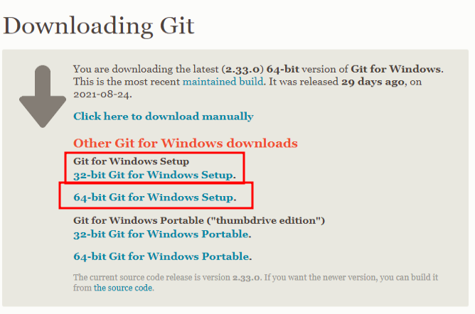
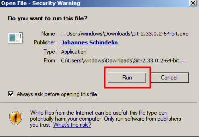
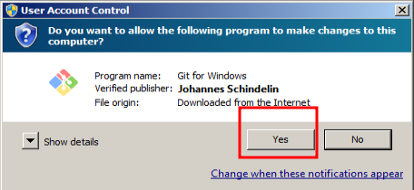
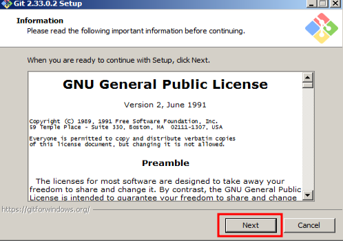
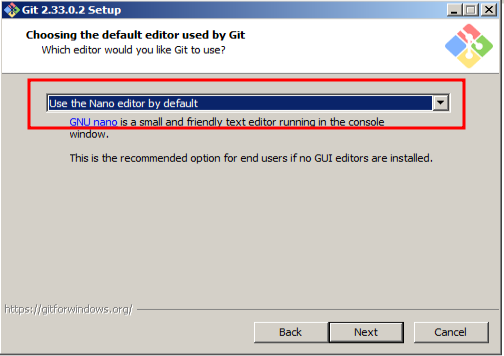
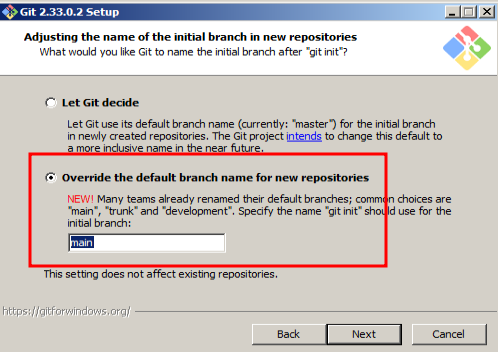
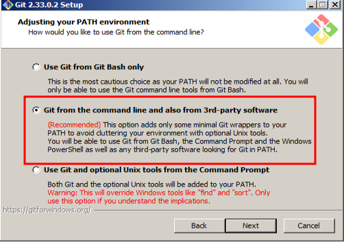
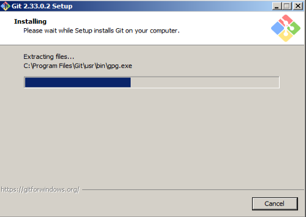
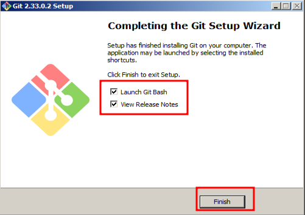
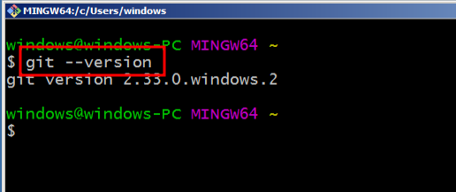

# Pertemuan 1

oke di pertemuan ini kita akan belajar bagaimana cara menginstal git di komputer temen-temen masing-masing dan cara membuat akun di github. 

hmmm, buat yang udah install jangan ngegas tunggu materi pekan depan aja :expressionless: :smile:


## Instalasi Git

### Windows

oke pertama kita akan menginstall git di windows dulu ya, silahkan ikuti langkah-langkah berikut:

- silahkan kunjungi link berikut [https://git-scm.com/download/win](https://git-scm.com/download/win)
    > bakal otomatis download aplikasi git, tunggu aja sampai selesai download. kamu udah biasa menunggu kan. menunggu ketidakpastian dari dia :disappointed:

- kalo gak otomasis ke download yaudah gpp. 
    
    
    pilih yang sesuai dengan sisem operasi temen-temen. 

    > jangan salah pilih :sweat:

- Kemudian pilih run, yes, next <br/>
    <br/>
    
    <br/>
    
    <br/>
    

- next trus sampai disini, pilih yang **NANO** karena lebih friendly  
    <br/>
    
- next lagi  
    <br/>

- dan ini  
    <br/>
- tunggu selesai dan finish <br/>
     <br/> 
    
     <br/> 

    jangan lupa pilih **Launch Git Bash** buat jalanin terminal. klo lupa centang cari di start menu, cari **Git Bash** dan klik it !.  


- Oke klo sudah, liat terminalnya dan jalankan perintah berikut :<br/>  
      <br/>
    

    nah kalian udah berhasil install git di komputer tercinta kalian. next ke cara buat akun github ya :grinning:  <br/>


### Linux

nah buat linux, tentunya tidak serumit dan se bertele-tele yang diatas. cukup ikuti dan jalankan perintah berikut di terminal kalian !  

> biasanya git sudah terinstall menjadi aplikasi bawaan ketika menginstall OS linux. tapi kalo emang belum, ikutin langkah berikut ini:  

**Ubuntu**

```
sudo apt-get update \
sudo apt-get install git-all
```

**Fedora**

```
sudo dnf install git-all
```

**Arch**

```
sudo pacman -S git
```

cukup gampang kan ?, gak perlu langkah yang panjang :bowtie:

## Akun Github

sebelum membuat akun github, kita kenalan dulu deh sama github.  
> ada pepatah mengatakan: "tak kenal maka kenalan"

Github merupakan salah satu dari layanan untuk menghosting atau menyimpan project kita di cloud. kenapa saya bilang salah satu, karena selain github, masih ada banyak layanan hosting git lainnya seperti *Gitlab*, *BitBucket*, *AWS*, dll.

tapi karena kita kedepan akan menggunakan github sebagai layanan hosting kita, maka kali ini kita akan cari tahu cara membuat akun digithub.

> jika kalian mau explore lebih jauh, silahkan buka browser kalian dan buka GOOGLE.

yuk lanjut, gpp klo belum faham, nanti ditanya waktu forum discussion ya.

langsung saja ya, 

- pertama silahkan kunjungi link berikut: 

    [Github: https://github.com/](https://github.com/)  

    kemudia pilih sign up  
    
      

- kemudian silahkan ikuti langkah-langkahnya, mudah kok.

nanti klo sudah, akan ada diminta untuk verifikasi dari email, silahkan ikuti langkah-langkahnya ya.  

saya harap semuanya menginstall git dan daftar akun github, karena kedepan semua tugas dan latihan, akan dikumpulkan melalui github. oke !!  


# Usefull Link

- [https://www.git-tower.com/blog/git-hosting-services-compared/](https://www.git-tower.com/blog/git-hosting-services-compared/)

- https://git-scm.com/book/en/v2/Getting-Started-Installing-Git
