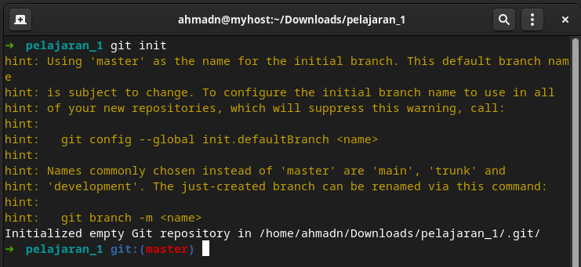
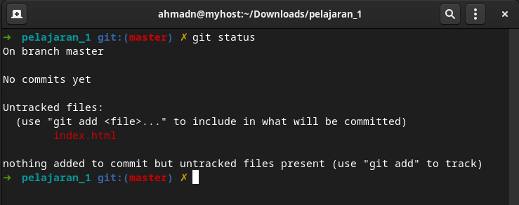

# Praktik 1

1.  Buat folder baru dengan nama `"pelajaran_1"`
2.  Didalam folder `pelajaran_1` kita akan melakukan inisialisasi git untuk pertama kali. caranya silahkan ikuti intruksi dibawah ini:

    - masuk ke cmd/terminal dan masuk ke folder `pelajaran_`

      `cd ~/Document/pelajaran_1`
      <br>

      > biar enggak binggung buka foldernya di visual studio code aja. di vscodenya **pilih file > open folder > pelajaran_1**

    - lalu jalan kan :

      `git init`
      <br>

      > klo di vscode : kombinasi **ctrl + `** (backtick, samping kiri angka 1) atau pilih **Terminal > new terminal**

      contoh outputnya akan seperti ini : <br>

      
      <br>

    - ubah default branch name menjadi `main`. caranya

      `git branch -m main`

    - melihat status atau keadaan file saat ini

      `git status`
      <br>

      > anda akan mendapatkan pesan <br>
      > on branch main <br>
      > no commits yet
      > ....

      ini berarti branch kita sedang tidak ada perubahan apapun

3.  Perubahan (1)

    - buat file index.html

      ```html
      <!DOCTYPE html>
      <html lang="en">
        <head>
          <meta charset="UTF-8" />
          <meta http-equiv="X-UA-Compatible" content="IE=edge" />
          <meta
            name="viewport"
            content="width=device-width, initial-scale=1.0"
          />
          <title>Belajar git</title>
        </head>
        <body>
          <div class="kotak" id="kotak"></div>
            <button id="button">Putar</button>
        </body>
      </html>
      ```

    - simpan file-nya kemudian balik lagi ke cmd/terminal, kemudian jalankan perintah

      `git status`
      maka akan muncul status seperti dibawah ini :<br>
      <br>

    - ini berarti kita sedang berada dalam keadaan `modified` dan didalam `working area`

      > ingat !
      > _Working Area_ itu tempat kalian mengedit file

    - selanjutnya kita akan menambahkan file `index.html` kedalam `staging area`

      `git add index.html`
      <br>

      > ingat !
      > _Staging Area adalah tempat dimana setiap perubahan disimpan dan akan siap untuk dibuatkan snapshot_

    - jika kalian jalankan `git status` lagi maka kalian akan melihat file `index.html` berwarna hijau. jangan khawatir, ini hanya tanda bahwa file tersebut sudah berada di staging area
    - selanjutnya kita akan membuatkan snapshot untuk perubahan pertama kita :
      `git commit -m "struktur awal aplikasi"`

    - setelah menjalankan perintah di atas, jika kalian menjalankan `git status` lagi maka working area kalian bersih lagi, karena setiap perubahan sudah dibuatkan snapshot dan disipan kedalam `.git repository local`.

4.  Perubahan 2
    - sekarang modifikasi file `index.html` tadi dengan menambahkan code css berikut

     ```html
      <!DOCTYPE html>
        <html lang="en">
          <head>
            <meta charset="UTF-8" />
            <meta http-equiv="X-UA-Compatible" content="IE=edge" />
            <meta name="viewport" content="width=device-width, initial-scale=1.0" />
            <title>Belajar git</title>
            <style>
              body {
                margin: 0;
                padding: 0;
                height: 100vh;
                display: flex;
                flex-direction: column;
                align-items: center;
                justify-content: center;
                background-color: lightpink;
              }
              .kotak {
                width: 100px;
                height: 100px;
                background-color: lightgreen;
              }
              button {
                border: none;
                padding: 10px 15px;
                margin-top: 50px;
                cursor: pointer;
              }
            </style>
          </head>
          <body>
            <div class="kotak" id="kotak"></div>
            <button id="button">Putar</button>

            <script src="script.js"></script>
          </body>
        </html>

      ```

    - selanjutnya ulangi langkah seperti diatas:
      ```bash
        git add . 
        git commit -m "Menambahkan style css"
        git status

        #jalankan satu-satu
      ```
  
5.  Perubahan 3 

    - buka lagi file `index,html` dan ubah kodenya seperti ini

      ```html
      <!DOCTYPE html>
        <html lang="en">
          <head>
            <meta charset="UTF-8" />
            <meta http-equiv="X-UA-Compatible" content="IE=edge" />
            <meta name="viewport" content="width=device-width, initial-scale=1.0" />
            <title>Belajar git</title>
            <style>
              body {
                margin: 0;
                padding: 0;
                height: 100vh;
                display: flex;
                flex-direction: column;
                align-items: center;
                justify-content: center;
                background-color: lightpink;
              }
              .kotak {
                width: 100px;
                height: 100px;
                background-color: lightgreen;
              }

              .animasi {
                animation: putar 2s linear infinite;
              }

              @keyframes putar {
                100% {
                  transform: rotate(360deg);
                }
              }
              button {
                border: none;
                padding: 10px 15px;
                margin-top: 50px;
                cursor: pointer;
              }
            </style>
          </head>
          <body>
            <div class="kotak" id="kotak"></div>
            <button id="button">Putar</button>

            <script src="script.js"></script>
          </body>
        </html>

      ```

    - buat file baru dengan nama `script.js`, lalu tuliskan kode berikut:
      ```javascript
      const kotak = document.getElementById("kotak")
      const button = document.getElementById("button")


      button.addEventListener('click', () =>{
          kotak.classList.toggle('animasi')
          let text = button.innerHTML === "Putar" ? "Stop" : "Putar"
          button.innerHTML = text
      })
      ```

    - pastikan untuk menyimpan semua perubahan `CTRL + S` kemudian ulangi langkah sebelumnya:
      ```bash
        git add . 
        git commit -m "menambahkan animasi"
        git status

        #jalankan satu-satu
      ```

6. untuk melihat semua log atau snaphost yang sudah kita buat tulis : `git log --oneline`
