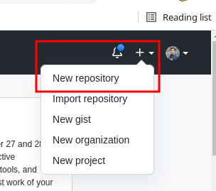
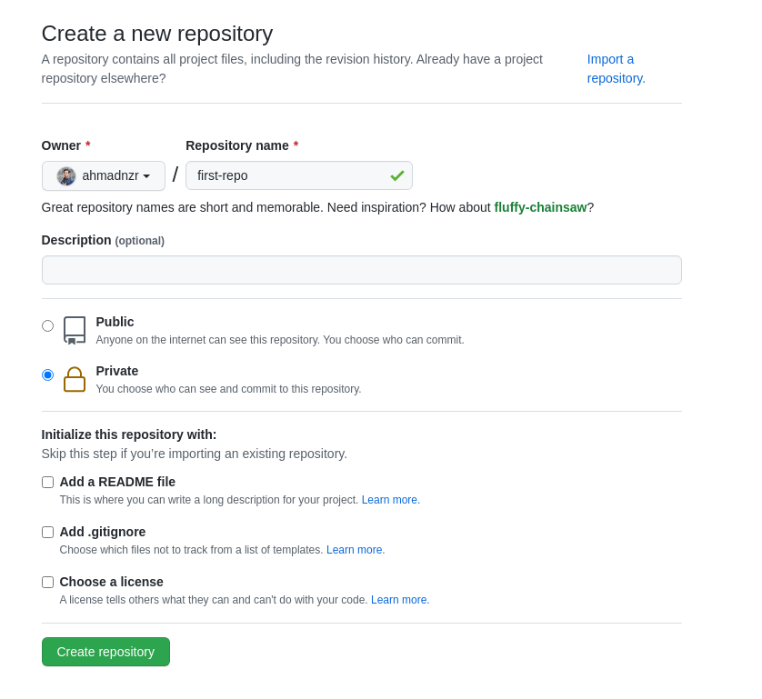
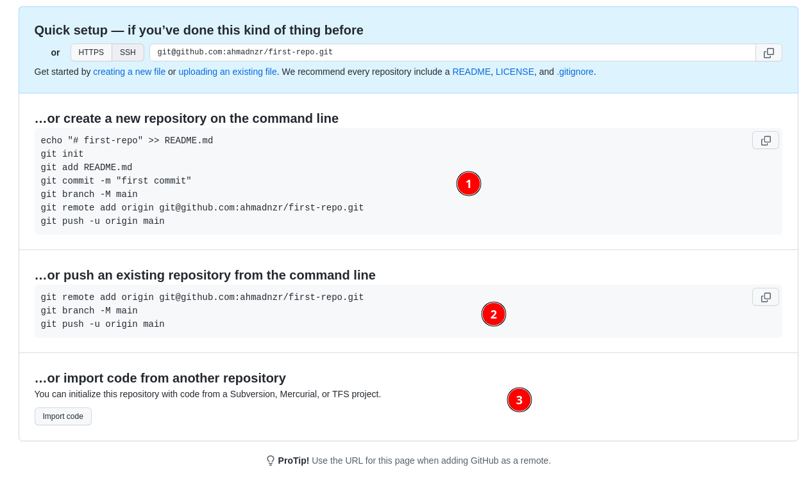
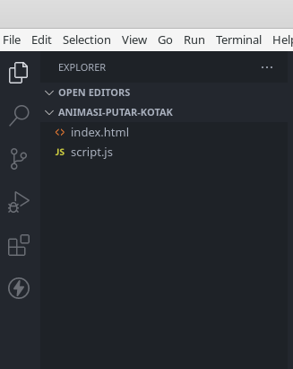
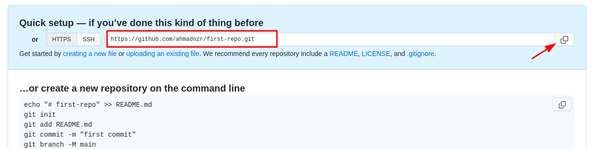
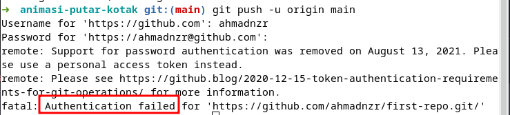
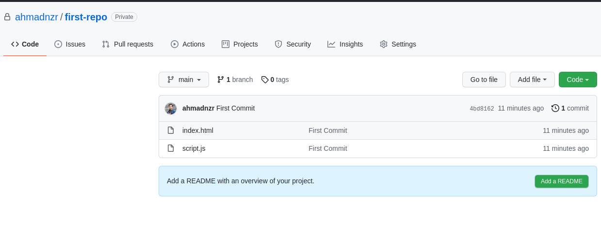

# Git dan Github

**Note**
> Pastikan kamu sudah memiliki akun github !. jika belum punya silahkan dibuat dulu ya :smile:

## Langkah-langkah Membuat Repository

1. Login dulu ke akun github kalian

2. Pojok kanan atas, pilih *New Repository*<br>
     <br>

3. Buat nama repository

     <br>

    - `Public` : Semua orang bisa melihat repo dengan type public
    - `Private` : Hanya anda dan orang-orang yang anda pilih, dapat melihat repo ini
    - file `README.md` : berisi dokumentasi dari repo anda. sementara kita tidak centang dulu
    - file `.gitignore` : berisi nama file atau folder yang akan diabaikan saat melakukan push ke github. sementara kita tidak centang dulu
    file `LICENSE` : berisi lisensi dari dari repo atau project kalian. sementara kita tidak centang dulu

4. Click tombol **Create Repository**.

     <br/>

    - :one: : Jika kalian belum memiliki repo di local silahkan ikuti langkah ini
        ```bash
        echo "# first-repo" >> README.md
        git init
        git add README.md
        git commit -m "first commit"
        git branch -M main
        git remote add origin <repo_url>
        git push -u origin main
        ```

    - :two: : Pilih ini jika kalian sudah memiliki repo yang mau kalian upload ke github
        ```bash
        git remote add origin <repo_url>
        git branch -M main
        git push -u origin main
        ```

    - :three: : Gunakan ini kalo kalian mau import code atau upload folder <br/>
        **Note**
        > Jangan lupa ganti `<repo_url>` dengan link masing-masing !. atau cukup copas yang dari repo kalian masing-masing


## Praktik

> Yuk Latihan !. biar makin faham, semakin kalian berlatih maka semakin kalian terbiasa dengan perintah-perintahnya

1. Buat repository baru dengan nama `animasi-putar-kotak`
    > Silahkan ikuti langkah di atas untuk membuat repo !

2. Silahkan download assets dibawah ini, kemudian simpan di komputer kalian
[:link: **Download Assets**](./assets.zip)

3. Extract assets yang kalian download
4. Masuk kedalam folder lalu buka di visual studio code

     <br/>

5. Buka terminal di vscode kalian
    > - bisa menggunakan keyword `CTRL + `\(backtick)`
    > - atau pilih `Terminal > New Terminal`

6. Saatnya kita konfigurasi git <br>
    karena kita belum melakukan konfigurasi apapun, sebelum mengupload ke github, kita harus konfigurasi git didalam folder kerja kita.
    
    Ikuti perintah berikut !
    ```bash
    //inisialisasi git
    git init

    //Ganti nama branch master menjadi main
    git branch -m main

    //menambahkan file kedalam staging area
    git add .

    //menambahkan file kedalam .git repository

    git commit -m "Firts Commit"
    ```
    Jika kalian menjalankan `git status`, harusnya working tree kalian clean.

7. Menambkan remote repository

    Kembali lagi ke browser dan copy link repo kalian<br>
    

    Pastikan kalian memilih **https** kalo belum **setup ssh**. Setelah itu buka terminal di vscode lagi dan jalankan perintah berikut:

    ```bash
    git remote add origin <repo_url>
    ```
    >Pastikan <repo_url> kalian ganti dengan link repo yang kalian copy sebelumnya
    
    Kalo sudah, untuk melihat remote repo kalian, jalankan perintah :

    ```bash
    git remote -v

    //Output jangan dicopy
    origin	https://github.com/ahmadnzr/first-repo.git (fetch)
    origin	https://github.com/ahmadnzr/first-repo.git (push)
    ```

8. Upload ke github<br>
    Untuk mengupload semua perubahan yang kita simpan di local, kita bisa menggunakan perintah berikut:

    ```bash
    git push -u origin main

    ```

    Jika kalian gagal mengupload atau push, silahkan pastikan kalian mengikuti langkah-langkah di atas dengan benar ! atau jika errornya seperti dibawah ini :
    <br>
     <br/>

    Itu karena *Password Authentication* sudah tidak didukung lagi untuk github. untuk mengatasinya kalian bisa *setup ssh* atau lakukan perintah di atas (`git push -u origin main`) didalam **terminal vscode** kalian, nanti akan dibuatkan token untuk otentikasi.

9. Reload browser kalian<br>
    Kalo kalian sudah berhasil mengupload atau push perubahan di local computer, file-file yang ada dilocal komputer kalian sudah ada di remote repo kalian (github)
    <br>
     <br/>


## Challenge

> "Dengan menantang diri kalian sendiri, kalian akan tau kekurangan kalian dan kalian akan terbiasa menghadapi masalah dan menyelesaikannya !"<br>
~ orang

latihannya, silahkan buat file dengan nama `README.md` di local computer kalian, kemudian push kedalam remote repo kalian masing-masing.

Isi file `README.md` dengan text berikut (optional) atau kalian bisa membuat versi kalian sendiri :

```readme
# Animasi Putar Kotak
animasi sederhana untuk memutar kotak menggunakan html, css, dan javascript

## Kontribusi
yuk bantu kembangin biar lebih keren :satisfied:

```

jika sudah berikan pesan commit `"add README.md"`

 *Good Luck* :kissing_heart::kissing_heart::kissing_heart: