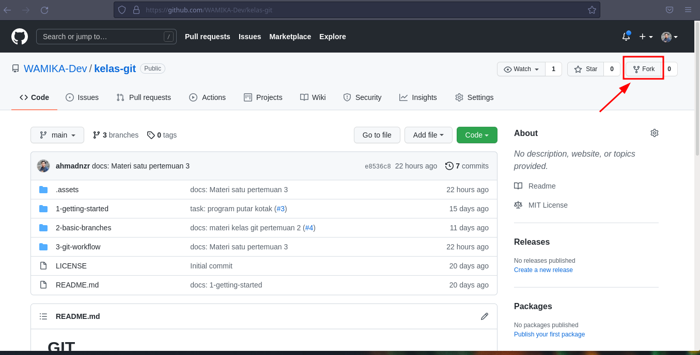
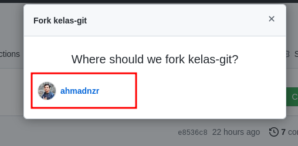
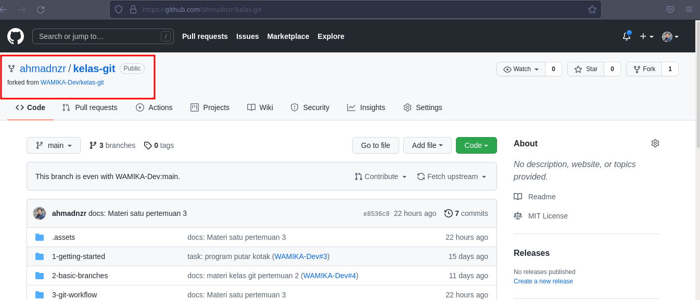
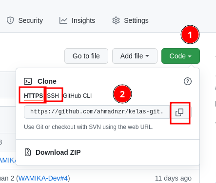
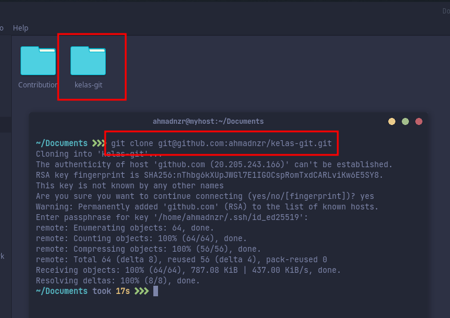
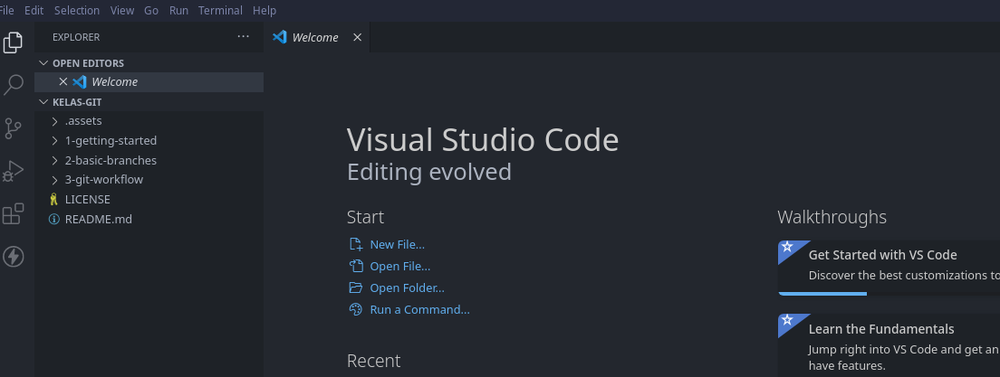

# Pull Request

> **Pull Request** merupakan istilah saat kita meminta untuk menggabungkan perubahan dari kita dengan ke branch tujuan. Pull Request dan Merge Request merupakan istilah yang sama, biasanya istilah Merge Request digunakan di gitlab.

Ketika kamu ingin berkontribusi dalam sebuah project, maka penting buat kamu faham bagaimana cara kerja dan cara membuat Pull Request, pada pelajaran ini kita akan belajar bersama bagaimana cara untuk membuat Pull Request.

Temen-temen bisa ikuti langkah-langkahnya ya, biar sekalian praktik :kissing_heart:

*Let's Goo !* :sunglasses::sunglasses:

## Langkah 1

Fork repository `kelas-git` dari **WAMIKA-dev** caranya ikuti langkah berikut:
> *Forking Repository* merpuakan istilah untuk mencopy file atau repository orang lain ke akun kita, semua informasi commit, branch, dll akan ikut di copy.

**Sebelum lanjut, Pastikan kalian sudah login ke akun github masing-masing !!!**

- kunjungi link berikut:

    [:point_right: :link: **kelas-git**](https://github.com/WAMIKA-Dev/kelas-git)

- Pojok kanan atas, pilih menu fork dan pilih akun kalian
    <br>
    
    <br>
    
    <br>
- Repository `kelas-git` dari **WAMIKA-dev** akan ke salin ke akun kalian
    <br>
    
    <br>

Sampai disini kalian sudah menyelesaikan langkah 1. *Great Job* :ok_hand::ok_hand::ok_hand:

## Langkah 2

Masih di halaman browser yang tadi, sekarang kita akan akan mencopy file atau repository yang kita *fork* tadi ke local computer kita.

> Clone Repository merupakan istilah untuk men-*clone* atau men-*copy* repo yang ada di *remote repo* ke *local repo* (komputer kita)

- Click button **Code** yang berwarna hijau, kemudian copy url-nya

    > Jika kalian sudah setup ssh bisa pilih tab ssh, kemudian copy linknya. atau bisa juga juga menggunakan link https

    klo ada yang tanya, *Kenapa kita gak download file `.zip`-nya aja ? <br>

    selain ribet, biasakan pake terminal/cmd lah biar terbiasa :unamused::unamused:
    <br>
    
    <br>

- Buka terminal, atau cmd, atau git bash

    Pengguna windows disarankan untuk menggunakan **Git Bash**
    <br>
    Masuk ke folder kerja kalian, misalkan saya mau clone repo ini di documents

    ```bash
    //For unix (Linux, MacOS) user
    cd ~/Documents

    //For Windows User
    cd C:\Users\<user_name>\Documents
    ```
    Kalian boleh pake folder manapun

- Jalankan perintah `git clone`

    Dari folder documents tadi, jalan perintah ini di terminal/cmd/git bash

    ```bash
    git clone <repo_url>

    //contoh
    git clone git@github.com:ahmadnzr/kelas-git.git
    ```

    **Ganti `<url_repo>` dengan url yang kalian copy sebelumnya !!!**
    <br>
    
    <br>

Sampai disini kalian sudah berhasil mencopy repo ke local computer kalian, yuhuuuuuuuu, sekarang waktunya kita fokus (ngoding) :sleeping::sleeping::sleeping:

## Langkah 3

Biar lebih gampang, gak bolak balik ke terminal, window, texteditor. kalian bisa menggunakan texteditor **Visual Studio Code**

- Buka folder `kelas-git` kedalam vscode

    caranya buka `vscode` > `open folder` > pilih `kelas-git`
    <br>
    
    <br>

- buat branch baru dengan nama `latihan/pull-request`

    > kita disarankan untuk kerja di branch baru agar branch main tidak terganggu

    ikuti perintah berikut :

    ```bash
    git checkout -b latihan/pull-request
    ```
- Selanjutnya kita bisa kerja deh di branch `latihan/pull-request` tanpa menggangu branch main kita

