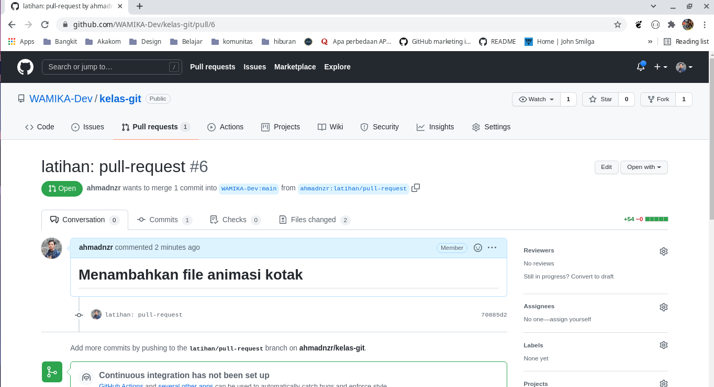

# Pull Request

> **Pull Request** merupakan istilah saat kita meminta untuk menggabungkan perubahan dari kita dengan ke branch tujuan. Pull Request dan Merge Request merupakan istilah yang sama, biasanya istilah Merge Request digunakan di gitlab.

Ketika kamu ingin berkontribusi dalam sebuah project, maka penting buat kamu faham bagaimana cara kerja dan cara membuat Pull Request, pada pelajaran ini kita akan belajar bersama bagaimana cara untuk membuat Pull Request.

Temen-temen bisa ikuti langkah-langkahnya ya, biar sekalian praktik :kissing_heart:

_Let's Goo !_ :sunglasses::sunglasses:

## Langkah 1

Fork repository `kelas-git` dari **WAMIKA-dev** caranya ikuti langkah berikut:

> _Forking Repository_ merpuakan istilah untuk mencopy file atau repository orang lain ke akun kita, semua informasi commit, branch, dll akan ikut di copy.

**Sebelum lanjut, Pastikan kalian sudah login ke akun github masing-masing !!!**

- kunjungi link berikut:

  [:point_right: :link: **kelas-git**](https://github.com/WAMIKA-Dev/kelas-git)

- Pojok kanan atas, pilih menu fork dan pilih akun kalian
  <br>
  
  <br>
  
  <br>
- Repository `kelas-git` dari **WAMIKA-dev** akan ke salin ke akun kalian
  <br>
  
  <br>

Sampai disini kalian sudah menyelesaikan langkah 1. _Great Job_ :ok_hand::ok_hand::ok_hand:

## Langkah 2

Masih di halaman browser yang tadi, sekarang kita akan akan mencopy file atau repository yang kita _fork_ tadi ke local computer kita.

> Clone Repository merupakan istilah untuk men-_clone_ atau men-_copy_ repo yang ada di _remote repo_ ke _local repo_ (komputer kita)

- Click button **Code** yang berwarna hijau, kemudian copy url-nya

  > Jika kalian sudah setup ssh bisa pilih tab ssh, kemudian copy linknya. atau bisa juga juga menggunakan link https

  klo ada yang tanya, \*Kenapa kita gak download file `.zip`-nya aja ? <br>

  selain ribet, biasakan pake terminal/cmd lah biar terbiasa :unamused::unamused:
  <br>
  
  <br>

- Buka terminal, atau cmd, atau git bash

  Pengguna windows disarankan untuk menggunakan **Git Bash**
  <br>
  Masuk ke folder kerja kalian, misalkan saya mau clone repo ini di documents

  ```bash
  //For unix (Linux, MacOS) user
  cd ~/Documents

  //For Windows User
  cd C:\Users\<user_name>\Documents
  ```

  Kalian boleh pake folder manapun

- Jalankan perintah `git clone`

  Dari folder documents tadi, jalan perintah ini di terminal/cmd/git bash

  ```bash
  git clone <repo_url>

  //contoh
  git clone git@github.com:ahmadnzr/kelas-git.git
  ```

  **Ganti `<url_repo>` dengan url yang kalian copy sebelumnya !!!**
  <br>
  
  <br>

Sampai disini kalian sudah berhasil mencopy repo ke local computer kalian, yuhuuuuuuuu, sekarang waktunya kita fokus (ngoding) :sleeping::sleeping::sleeping:

## Langkah 3

Biar lebih gampang, gak bolak balik ke terminal, window, texteditor. kalian bisa menggunakan texteditor **Visual Studio Code**

- Buka folder `kelas-git` kedalam vscode

  caranya buka `vscode` > `open folder` > pilih `kelas-git`
  <br>
  
  <br>

- buat branch baru dengan nama `latihan/pull-request`

  > kita disarankan untuk kerja di branch baru agar branch main tidak terganggu

  ikuti perintah berikut :

  - buka terminal di vscode: `Terminal > New Terminal`
  - Jalan kan perintah dibawah ini:

    ```bash
    git checkout -b latihan/pull-request
    ```

- Selanjutnya kita bisa kerja deh di branch `latihan/pull-request` tanpa menggangu branch main kita

## Langkah 3

Disini kita sudah bisa ber-eksplorasi/ngoding/tambah file baru, dll. perubahan yang terjadi di branch `latihan/pull-request` tidak akan berpengaruh secara langsung ke branch `main`. Branch `main` kita gunakan untuk menerima perubahan dari _Upstream Repository_. <br>

Sekarang kita tidak ngoding, sebagai latihan silahkan ikuti langkah-langkah berikut:

- Di dalam folder `kelas-git/3-git-workflow/latihan/` buat folder dengan nama NIM kalian masing-masing

  contoh:
  <br>
  
  <br>

- Download asset dibawah ini

  [:link: Download](assets.zip)

- Extract file

  Extract isi file `assets.zip` yang sudah kalian download, kemudian pindahkan isi folder `animasi-putar-kotak` ke dalam folder nim kalian
  <br>
  Jadinya seperti ini:
  <br>
  
  <br>

    > bayangkan kita sudah selesasi ngoding, walaupun kita cuma copy paste karena fokus kita sekarang untuk membua pull request !


## Langkah 4

Karena kita suda selesai ngoding atau dengan kerjaan kita, saatnya kita mengupload perubahan kita ke cloud dan meminta agar owner repository utama menggabungkan perubahan yang kita buat. ini bakal jadi langkah terseru :heart_eyes::heart_eyes: <br>

- Siapkan perubahan kita

    seperti biasa sekarang kita akan membuat repo di local siap untuk di push. ikuti perintah berikut:

    ```bash
    git add .
    git commit -m "latihan: pull-request"
    ```

- Tambahkan link upstream repository `kelas-git` dari WAMIKA-dev

    > agar kita bisa mengambil perubahan dari repo `kelas-git` milik WAMIKA-dev, barangkali ada yang sudah mengupload perubahan dan kalian belum mendapatkan update

    ikuti perintah berikut: <br>
    
    - seperti biasa buka kembali terminal di vscode: `Terminal > New Terminal` dan pastikan kalian berada di folder `kelas-git` dan di branch `latihan/pull-request`

    - Jalankan perintah perintah berikut:

        ```bash
        git remote add upstream https://github.com/WAMIKA-Dev/kelas-git.git
        ```

    - Cek remote repo yang kalian miliki

         ```bash
        git remote -v
        ```

        
        <br>

    - Ambil perubahan dari `upstream main`

        kita akan mengambil perubahan dari branch `main` di repo `kelas-git` WAMIKA-dev <br>

        jalankan perintah berikut: 
        ```bash
        git pull -r upstream main
        ```
        
        <br>

        Karena belum terjadi perubahan apapun di upstream main jadi outputnya seperti di atas. bisa jadi waktu kalian kalian pull sudah ada perubahan


## Langkah 5

sekarang kita akan membuat link pull request

- Push dulu perubahan kita

    ```bash
    git push -u origin latihan/pull-request
    ```

- Klik link pull reqest di terminal
    
    <br>

    
    <br>

- kalian akan membuka redirect ke browser saat klik link diatas

    > Klik nya pake `CTRL+klik link` atau bisa copy link diatas dan paste di url bar browser kesayangan kalian

    hasilnya akan seperti dibawah ini:
     <br>

    
    <br>

    Pastikan pilih base repo `WAMIKA-dev/kelas-git`, pilih base/branch `main` <br>
    Ubah Title menjadi `latihan: pull-request`<br>
    Ubah Deskripsi seperti diatas<br>
    Klik tombol **Create Pull Request** <br>

- Yuhu kalian sudah membuat *Pull Request*

    <br>

    
    <br>

    Tinggal tunggu deh dari reviewer WAMIKA-dev untuk Merge **Pull Request** Kalian. :smile::smile:

## Langkah 6

Kerjakan langkah 1 - langkah 5

Kalo ada yang bertanya silahkan chat di group discord atau wa. atau bisa chat saya